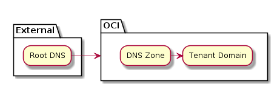
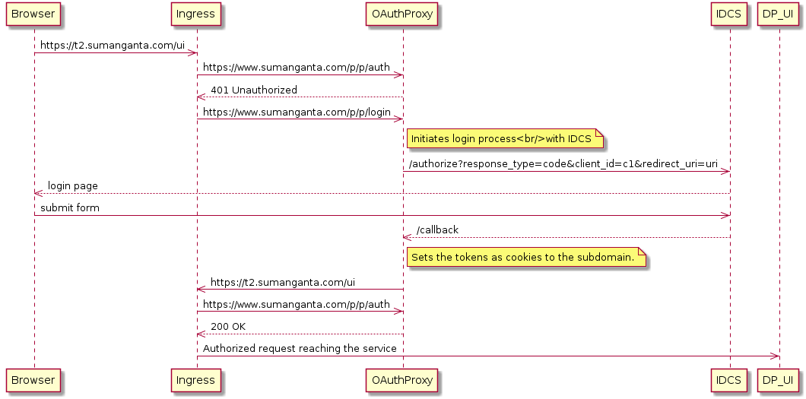

---
@title[Introduction]
### Tenant Request Lifecycle

<span style="color:gray">DP on Kubernetes</span>
---
@title[Tenant Request]
### Tenant Request
```
https://t1.sumanganta.com/eng/ic/api/process/v1/dp-executions
```
---
### Host Resolution

+++
### TLS
Wild card certificate for OIC
 ```
 *.sumanganta.com
 ```
---

### Ingress Definition
```Yaml
apiVersion: extensions/v1beta1
kind: Ingress
metadata:
  name: dp-ing
  annotations:
    nginx.ingress.kubernetes.io/rewrite-target: /
    nginx.ingress.kubernetes.io/auth-url: "https://www.sumanganta.com/p/p/auth"
    nginx.ingress.kubernetes.io/auth-signin: "https://www.sumanganta.com/p/p/login"
spec:
  tls:
  - secretName: sumanganta-domain-tls
  rules:
  - http:
      paths:
      - path: /eng
        backend:
          serviceName: dp-service
          servicePort: 80
```
---
### Authentication


+++
<span style="color:gray">OAuth Proxy</span>
- Each unauthenticated request is routed to the proxy - https://www.sumanganta.com/p/p
- Proxy is pre-seeded with clientId, secret per tenant via config maps (TODO)
- Takes care of routing requests to IDCS and get access token.
- Also acts as auth enforcement point
---
### Multi tenancy

<span style="color:gray">An executable object that represents an AWS Gateway call.</span>

```Yaml
apiVersion: v1
kind: ConfigMap
metadata:
  name: dp-config
  namespace: dp
data:
  t1.properties: |-
    engine.name=t1
    db.driverClass=org.h2.Driver
    db.url=jdbc:h2:mem:process-engine1;DB_CLOSE_DELAY=1000
    db.username=sa
    db.password=
  t2.properties: |-
    engine.name=t2
    db.driverClass=org.h2.Driver
    db.url=jdbc:h2:mem:process-engine2;DB_CLOSE_DELAY=1000
    db.username=sa
    db.password=
```
